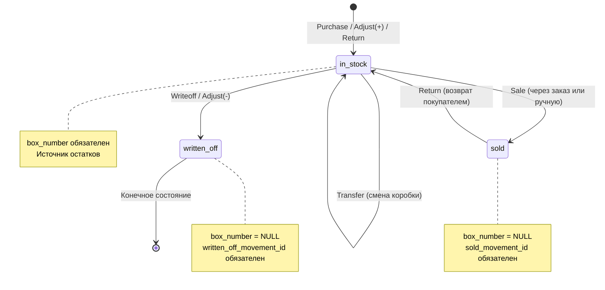
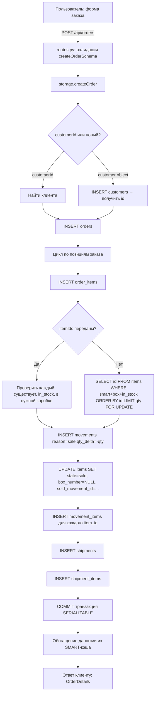
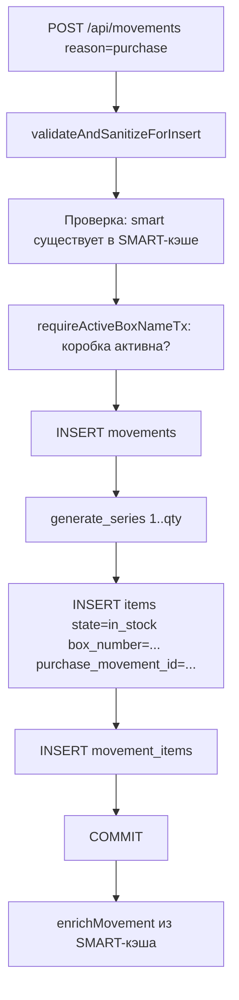
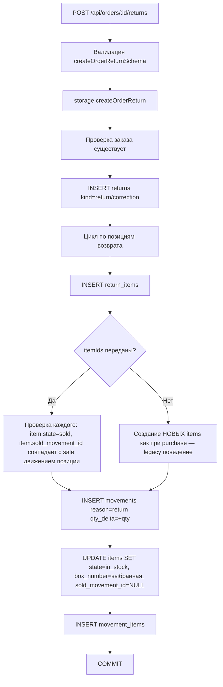
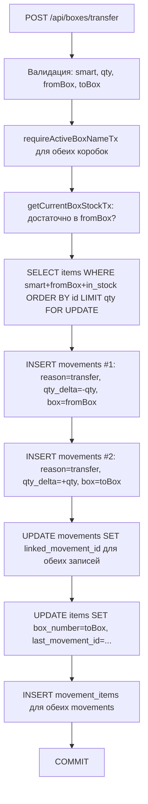
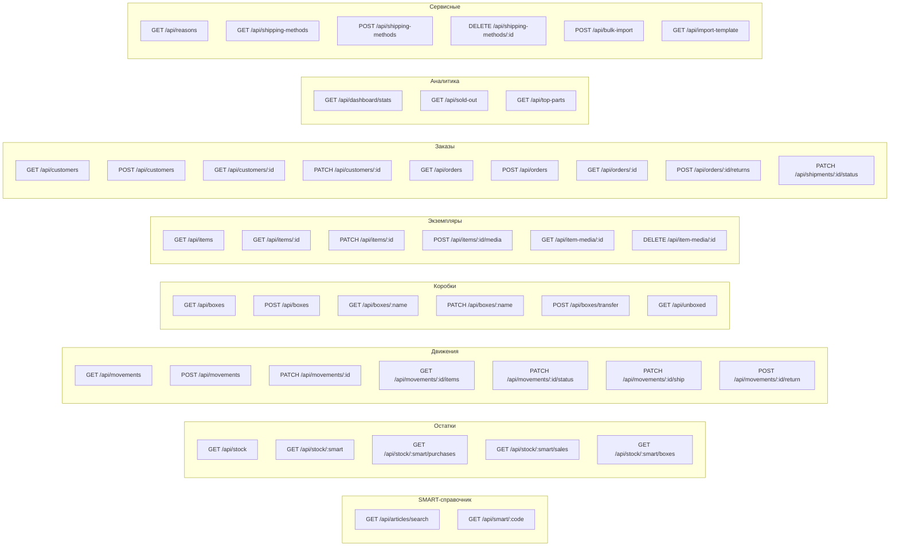

# Полная структура данных EventHorizon — глубокий анализ

> **Дата анализа:** 2026-02-10
> **Охват:** БД → Бэкенд → API → Клиент → Кэш
> **Статус:** фиксация текущего фактического состояния системы

---

## 0. Общая архитектура (bird's eye view)

Система состоит из **двух баз данных**, **серверного кэша в памяти**, **Python FastAPI бэкенда** и **React фронтенда**.

```
┌─────────────────────────────────────────────────────────────────────────┐
│                          КЛИЕНТ (React + Vite)                         │
│  ┌──────────────────────────────────────────────────────────────────┐   │
│  │  React Query (staleTime: Infinity, ручная инвалидация)          │   │
│  │  → queryKey как ключ кэша → invalidateQueries после мутаций     │   │
│  └──────────────────────────────────────────────────────────────────┘   │
│                              ↕ HTTP (fetch)                            │
├─────────────────────────────────────────────────────────────────────────┤
│                      БЭКЕНД (Python FastAPI + uvicorn)                 │
│  ┌──────────────┐   ┌────────────┐   ┌──────────────────────────────┐  │
│  │  routes.py   │──▶│ storage.py │──▶│  asyncpg (SERIALIZABLE txn)  │  │
│  │  (валидация, │   │ (бизнес-   │   │  ← inventory DB (read/write) │  │
│  │  обогащение) │   │  логика)   │   │                              │  │
│  └──────────────┘   └────────────┘   └──────────────────────────────┘  │
│         ↕                                                              │
│  ┌──────────────────────────────┐   ┌──────────────────────────────┐   │
│  │  SMART-кэш (in-memory Map)  │◀──│  parts_info DB (read-only)   │   │
│  │  обновляется каждые 10 мин  │   │  загрузка при старте          │   │
│  └──────────────────────────────┘   └──────────────────────────────┘   │
└─────────────────────────────────────────────────────────────────────────┘
```

**Ключевые принципы:**
- Две физически разные PostgreSQL базы (parts_info и inventory) — cross-DB JOIN невозможен
- SMART-код = уникальный идентификатор запчасти, вся бизнес-логика привязана к нему
- Источник истины для остатков = `inventory.items` (физические экземпляры), а не movements
- Все финансовые операции в SERIALIZABLE транзакциях с retry при конфликтах
- Клиент использует `staleTime: Infinity` — кэш обновляется только явной инвалидацией

---

## 1. ER-диаграмма (все таблицы и связи)

```mermaid
erDiagram
    %% === PARTS DB (read-only) ===
    SMART_REFERENCE {
        string smart PK "Уникальный SMART-код"
        string[] articles "Артикулы (русское: артикул)"
        string name "Наименование (русское: наименование)"
        string[] brand "Бренды (русское: бренд)"
        string[] description "Описания (русское: коннект_бренд)"
    }

    %% === INVENTORY DB ===
    BOXES {
        string name PK "Уникальное имя (K-1, ПОЛКА-3)"
        string name_norm UK "Нормализованное имя"
        string description "Описание (nullable)"
        boolean is_active "Активна или закрыта"
        timestamp created_at "Дата создания"
    }

    SHIPPING_METHODS {
        serial id PK "ID"
        text name UK "Название (Почта России, СДЭК...)"
        boolean is_pickup "Флаг самовывоза"
        timestamp created_at "Дата создания"
    }

    CUSTOMERS {
        serial id PK "ID клиента"
        text name "Имя (обязательно)"
        text phone "Телефон (nullable)"
        text note "Заметка (nullable)"
        timestamp archived_at "Архивирован (nullable)"
        timestamp created_at "Дата создания"
        timestamp updated_at "Дата обновления"
    }

    ORDERS {
        serial id PK "ID заказа"
        integer customer_id FK "Клиент"
        text note "Заметка заказа (nullable)"
        timestamp created_at "Дата создания"
        timestamp updated_at "Дата обновления"
    }

    ORDER_ITEMS {
        serial id PK "ID позиции"
        integer order_id FK "Заказ"
        varchar smart "SMART-код товара"
        integer qty "Количество (>0)"
        numeric sale_price "Цена продажи за единицу"
        timestamp created_at "Дата создания"
    }

    SHIPMENTS {
        serial id PK "ID отправки"
        integer order_id FK "Заказ"
        integer shipping_method_id FK "Способ доставки"
        text track_number "Трек-номер (nullable)"
        numeric delivery_price "Стоимость доставки за отправку"
        varchar delivery_payer "seller или buyer"
        varchar status "pending/shipped/delivered"
        timestamp created_at "Дата создания"
        timestamp updated_at "Дата обновления"
    }

    SHIPMENT_ITEMS {
        serial id PK "ID"
        integer shipment_id FK "Отправка"
        integer order_item_id FK "Позиция заказа"
        integer qty "Кол-во в этой отправке"
        timestamp created_at "Дата создания"
    }

    RETURNS {
        serial id PK "ID возврата"
        integer order_id FK "Заказ"
        varchar kind "return или correction"
        text note "Причина возврата (nullable)"
        numeric return_price "Стоимость обратной доставки"
        varchar return_payer "seller или buyer"
        integer shipping_method_id FK "Способ обратной доставки (nullable)"
        text track_number "Трек возврата (nullable)"
        timestamp created_at "Дата создания"
    }

    RETURN_ITEMS {
        serial id PK "ID"
        integer return_id FK "Возврат"
        integer order_item_id FK "Позиция заказа"
        integer qty "Кол-во возвращённых"
        timestamp created_at "Дата создания"
    }

    MOVEMENTS {
        serial id PK "ID операции"
        varchar smart "SMART-код товара"
        integer qty_delta "Изменение кол-ва (+/-)"
        varchar reason "purchase/sale/return/writeoff/adjust/transfer"
        text note "Примечание (nullable)"
        numeric purchase_price "Цена закупки (nullable)"
        numeric sale_price "Цена продажи (nullable)"
        numeric delivery_price "Стоимость доставки (nullable)"
        varchar box_number "Номер коробки (nullable)"
        text track_number "Трек-номер (nullable)"
        integer shipping_method_id FK "Способ доставки (nullable)"
        varchar sale_status "awaiting_shipment/shipped (nullable)"
        integer order_id FK "Заказ (nullable)"
        integer order_item_id FK "Позиция заказа (nullable)"
        integer shipment_id FK "Отправка (nullable)"
        integer return_id FK "Возврат (nullable)"
        integer linked_movement_id FK "Парное движение transfer (nullable)"
        timestamp created_at "Дата операции"
    }

    ITEMS {
        bigserial id PK "ID экземпляра"
        varchar smart "SMART-код"
        varchar state "in_stock/sold/written_off"
        varchar box_number FK "Коробка (если in_stock)"
        text note "Заметка (nullable)"
        integer purchase_movement_id FK "Движение покупки"
        integer sold_movement_id FK "Движение продажи"
        integer written_off_movement_id FK "Движение списания"
        integer last_movement_id FK "Последнее движение"
        timestamp created_at "Дата создания"
        timestamp updated_at "Дата обновления"
    }

    MOVEMENT_ITEMS {
        integer movement_id FK "Движение"
        bigint item_id FK "Экземпляр"
    }

    ITEM_MEDIA {
        bigserial id PK "ID медиа"
        bigint item_id FK "Экземпляр"
        varchar kind "photo или video"
        text filename "Имя файла"
        text mime "MIME-тип"
        bigint size_bytes "Размер в байтах"
        text sha256 "SHA256 хеш"
        integer chunk_size "Размер чанка (default 1MB)"
        timestamp created_at "Дата создания"
        timestamp deleted_at "Soft-delete (nullable)"
    }

    ITEM_MEDIA_CHUNKS {
        bigint media_id PK "FK к item_media.id"
        integer idx PK "Индекс чанка"
        bytea data "Бинарные данные"
        timestamp created_at "Дата создания"
    }

    %% Связи
    CUSTOMERS ||--o{ ORDERS : "имеет заказы"
    ORDERS ||--|{ ORDER_ITEMS : "содержит позиции"
    ORDERS ||--o{ SHIPMENTS : "имеет отправки"
    ORDERS ||--o{ RETURNS : "имеет возвраты"
    SHIPMENTS ||--|{ SHIPMENT_ITEMS : "содержит позиции"
    SHIPMENT_ITEMS }o--|| ORDER_ITEMS : "из позиции заказа"
    RETURNS ||--|{ RETURN_ITEMS : "содержит позиции"
    RETURN_ITEMS }o--|| ORDER_ITEMS : "из позиции заказа"
    SHIPPING_METHODS ||--o{ SHIPMENTS : "используется в"
    SHIPPING_METHODS ||--o{ RETURNS : "обратная доставка"
    MOVEMENTS }o--o| ORDERS : "привязано к заказу"
    MOVEMENTS }o--o| ORDER_ITEMS : "привязано к позиции"
    MOVEMENTS }o--o| SHIPMENTS : "привязано к отправке"
    MOVEMENTS }o--o| RETURNS : "привязано к возврату"
    MOVEMENTS }o--o| MOVEMENTS : "linked_movement_id (transfer)"
    MOVEMENT_ITEMS }o--|| MOVEMENTS : "операция"
    MOVEMENT_ITEMS }o--|| ITEMS : "экземпляр"
    ITEMS }o--o| BOXES : "хранится в коробке"
    ITEMS }o--o| MOVEMENTS : "purchase_movement"
    ITEMS }o--o| MOVEMENTS : "sold_movement"
    ITEMS }o--o| MOVEMENTS : "written_off_movement"
    ITEMS }o--o| MOVEMENTS : "last_movement"
    ITEM_MEDIA }o--|| ITEMS : "прикреплено к"
    ITEM_MEDIA_CHUNKS }o--|| ITEM_MEDIA : "чанки файла"
```



---

## 2. Две базы данных

### 2.1. Parts DB (`parts_info`) — SMART-справочник

**Подключение:** `PARTS_DB_*` переменные окружения
**Режим:** только чтение
**Таблица:** `public.smart`

| Колонка в БД | Маппинг в коде | Тип | Описание |
|---|---|---|---|
| `smart` | `smart` | string | Уникальный SMART-код |
| `артикул` | `articles` | string[] | Массив артикулов |
| `наименование` | `name` | string/null | Название запчасти |
| `бренд` | `brand` | string[] | Массив брендов |
| `коннект_бренд` | `description` | string[] | Описания (коннект-бренды) |

> **Важно:** колонки в БД на русском языке. При загрузке в кэш маппятся в английские поля.

### 2.2. SMART-кэш (in-memory)

При старте (и далее каждые 10 минут) **вся** таблица `public.smart` загружается в `Map<string, SmartInternal>`.

Для каждой записи дополнительно хранятся нормализованные значения:
- `normalizedSmart` — приведён к нижнему регистру, убраны разделители
- `normalizedArticles` — массив нормализованных артикулов

**Fuzzy-поиск с ранжированием (search):**

| Score | Условие |
|---|---|
| 100 | Точное совпадение артикула |
| 90 | Артикул начинается с запроса |
| 80 | Артикул содержит запрос |
| 70 | Точное совпадение SMART |
| 60 | SMART начинается с запроса |
| 50 | SMART содержит запрос |

Максимум результатов: 50. Нормализация учитывает кириллические lookalikes (А→A, В→B и т.д.) и удаляет разделители.

### 2.3. Inventory DB — складской учёт

**Подключение:** `INVENTORY_DB_*` переменные окружения
**Режим:** чтение и запись
**Схема:** `inventory`

---

## 3. Все таблицы Inventory DB (детально)

### 3.1. `inventory.boxes` — реестр коробок

| Поле | Тип | Constraint | Описание |
|---|---|---|---|
| `name` | VARCHAR(50) | PK | Каноническое имя (K-1, ПОЛКА-3) |
| `name_norm` | VARCHAR(50) | UNIQUE | Нормализованное имя для проверки уникальности |
| `description` | TEXT | | Описание (nullable) |
| `is_active` | BOOLEAN | DEFAULT TRUE | Активна или закрыта |
| `created_at` | TIMESTAMP | DEFAULT NOW() | Дата создания |

**Инварианты:**
- Закрыть коробку можно, только если в ней нет items со `state='in_stock'`
- Нормализация имени: `normalize_box_name()` — lowercase, убраны `-`, `/`, пробелы
- При инициализации коробки создаются из уникальных `box_number` в movements

### 3.2. `inventory.shipping_methods` — способы доставки

| Поле | Тип | Constraint | Описание |
|---|---|---|---|
| `id` | SERIAL | PK | ID |
| `name` | TEXT | UNIQUE | Название |
| `is_pickup` | BOOLEAN | DEFAULT FALSE | Флаг самовывоза |
| `created_at` | TIMESTAMP | DEFAULT NOW() | Дата создания |

**Дефолтные записи:** Почта России, Яндекс, СДЭК, Авито доставка, Самовывоз (is_pickup=true)

### 3.3. `inventory.customers` — клиенты

| Поле | Тип | Constraint | Описание |
|---|---|---|---|
| `id` | SERIAL | PK | ID |
| `name` | TEXT | NOT NULL | Имя |
| `phone` | TEXT | | Телефон (nullable) |
| `note` | TEXT | | Заметка (nullable) |
| `archived_at` | TIMESTAMP | | Архивирован (nullable) |
| `created_at` | TIMESTAMP | DEFAULT NOW() | |
| `updated_at` | TIMESTAMP | DEFAULT NOW() | |

**Индексы:** `customers_name_idx` на name, `customers_created_at_idx` на created_at DESC

### 3.4. `inventory.orders` — заказы

| Поле | Тип | Constraint | Описание |
|---|---|---|---|
| `id` | SERIAL | PK | ID |
| `customer_id` | INTEGER | FK → customers(id), NOT NULL | Клиент |
| `note` | TEXT | | Заметка (nullable) |
| `created_at` | TIMESTAMP | DEFAULT NOW() | |
| `updated_at` | TIMESTAMP | DEFAULT NOW() | |

**Индексы:** `orders_customer_idx`, `orders_created_at_idx` DESC

### 3.5. `inventory.order_items` — позиции заказа

| Поле | Тип | Constraint | Описание |
|---|---|---|---|
| `id` | SERIAL | PK | ID |
| `order_id` | INTEGER | FK → orders(id) CASCADE, NOT NULL | Заказ |
| `smart` | VARCHAR | NOT NULL, Indexed | SMART-код |
| `qty` | INTEGER | CHECK (qty > 0), NOT NULL | Количество |
| `sale_price` | NUMERIC(10,2) | CHECK (>= 0), NOT NULL | Цена за единицу |
| `created_at` | TIMESTAMP | DEFAULT NOW() | |

### 3.6. `inventory.shipments` — отправки

| Поле | Тип | Constraint | Описание |
|---|---|---|---|
| `id` | SERIAL | PK | ID |
| `order_id` | INTEGER | FK → orders(id) CASCADE, NOT NULL | Заказ |
| `shipping_method_id` | INTEGER | FK → shipping_methods(id), NOT NULL | Способ доставки |
| `track_number` | TEXT | | Трек-номер (nullable) |
| `delivery_price` | NUMERIC(10,2) | CHECK (>= 0) | Стоимость за ВСЮ отправку |
| `delivery_payer` | VARCHAR(20) | CHECK (IN ('seller','buyer')) | Кто платит |
| `status` | VARCHAR(20) | CHECK (IN ('pending','shipped','delivered')), NOT NULL | Статус |
| `created_at` | TIMESTAMP | DEFAULT NOW() | |
| `updated_at` | TIMESTAMP | DEFAULT NOW() | |

**Статусы и их маппинг в movements.sale_status:**
- `pending` → `awaiting_shipment`
- `shipped` → `shipped`
- `delivered` → (нет прямого аналога в sale_status)

### 3.7. `inventory.shipment_items` — позиции в отправке

| Поле | Тип | Constraint | Описание |
|---|---|---|---|
| `id` | SERIAL | PK | ID |
| `shipment_id` | INTEGER | FK → shipments(id) CASCADE | Отправка |
| `order_item_id` | INTEGER | FK → order_items(id) CASCADE | Позиция заказа |
| `qty` | INTEGER | CHECK (qty > 0) | Количество в этой отправке |
| `created_at` | TIMESTAMP | DEFAULT NOW() | |
| | | UNIQUE(shipment_id, order_item_id) | |

### 3.8. `inventory.returns` — возвраты

| Поле | Тип | Constraint | Описание |
|---|---|---|---|
| `id` | SERIAL | PK | ID |
| `order_id` | INTEGER | FK → orders(id) CASCADE, NOT NULL | Заказ |
| `kind` | VARCHAR(20) | CHECK (IN ('return','correction')) | Тип |
| `note` | TEXT | | Причина (nullable) |
| `return_price` | NUMERIC(10,2) | CHECK (>= 0) | Стоимость обратной доставки |
| `return_payer` | VARCHAR(20) | CHECK (IN ('seller','buyer')) | Кто платит |
| `shipping_method_id` | INTEGER | FK → shipping_methods(id) | Способ (nullable) |
| `track_number` | TEXT | | Трек возврата (nullable) |
| `created_at` | TIMESTAMP | DEFAULT NOW() | |

### 3.9. `inventory.return_items` — позиции возврата

| Поле | Тип | Constraint | Описание |
|---|---|---|---|
| `id` | SERIAL | PK | ID |
| `return_id` | INTEGER | FK → returns(id) CASCADE | Возврат |
| `order_item_id` | INTEGER | FK → order_items(id) CASCADE | Позиция заказа |
| `qty` | INTEGER | CHECK (qty > 0) | Кол-во возвращённых |
| `created_at` | TIMESTAMP | DEFAULT NOW() | |
| | | UNIQUE(return_id, order_item_id) | |

### 3.10. `inventory.movements` — журнал операций (ЯДРО)

| Поле | Тип | Constraint | Описание |
|---|---|---|---|
| `id` | SERIAL | PK | ID |
| `smart` | VARCHAR | NOT NULL, Indexed | SMART-код |
| `qty_delta` | INTEGER | NOT NULL | Изменение (+/-) |
| `reason` | VARCHAR | NOT NULL, Indexed | purchase/sale/return/writeoff/adjust/transfer |
| `note` | TEXT | | Примечание (nullable) |
| `purchase_price` | NUMERIC(10,2) | | Цена закупки (nullable) |
| `sale_price` | NUMERIC(10,2) | | Цена продажи (nullable) |
| `delivery_price` | NUMERIC(10,2) | | Стоимость доставки (nullable) |
| `box_number` | VARCHAR(50) | Indexed | Номер коробки (nullable) |
| `track_number` | TEXT | | Трек-номер (nullable) |
| `shipping_method_id` | INTEGER | | Способ доставки (nullable) |
| `sale_status` | VARCHAR(50) | Indexed | awaiting_shipment / shipped (nullable) |
| `order_id` | INTEGER | FK, Indexed | Заказ (nullable) |
| `order_item_id` | INTEGER | FK, Indexed | Позиция заказа (nullable) |
| `shipment_id` | INTEGER | FK | Отправка (nullable) |
| `return_id` | INTEGER | FK | Возврат (nullable) |
| `linked_movement_id` | INTEGER | FK → movements(id) | Парное движение для transfer (nullable) |
| `created_at` | TIMESTAMP | DEFAULT NOW(), Indexed DESC | Дата операции |

**Индексы:**
- `movements_smart_idx` — по SMART-коду
- `movements_reason_idx` — по типу операции
- `movements_created_at_idx` — по дате DESC
- `movements_sale_status_idx` — по статусу продажи
- `movements_box_number_idx` — по коробке
- `movements_order_item_idx` — по order_item_id, order_id

### 3.11. `inventory.items` — экземпляры запчастей (ИСТОЧНИК ИСТИНЫ ДЛЯ ОСТАТКОВ)

| Поле | Тип | Constraint | Описание |
|---|---|---|---|
| `id` | BIGSERIAL | PK | Уникальный ID экземпляра |
| `smart` | VARCHAR | NOT NULL, Indexed | SMART-код |
| `state` | VARCHAR | CHECK (IN ('in_stock','sold','written_off')) | Текущее состояние |
| `box_number` | VARCHAR(50) | FK → boxes(name) | Коробка (nullable) |
| `note` | TEXT | | Заметка (nullable) |
| `purchase_movement_id` | INTEGER | FK → movements(id) | Движение покупки |
| `sold_movement_id` | INTEGER | FK → movements(id) | Движение продажи |
| `written_off_movement_id` | INTEGER | FK → movements(id) | Движение списания |
| `last_movement_id` | INTEGER | FK → movements(id) | Последнее движение |
| `created_at` | TIMESTAMP | DEFAULT NOW() | |
| `updated_at` | TIMESTAMP | DEFAULT NOW() | |

**CHECK-ограничения на уровне БД:**
- Если `state = 'in_stock'`, то `box_number` обязателен и не пустой
- Если `state != 'in_stock'`, то `box_number` должен быть NULL/пустой
- Если `state = 'sold'`, то `sold_movement_id` обязателен
- Если `state = 'written_off'`, то `written_off_movement_id` обязателен

**itemCode** = `EH-{id:06d}` (вычисляется, не хранится). Пример: id=42 → `EH-000042`

### 3.12. `inventory.movement_items` — связь движение ↔ экземпляры

| Поле | Тип | Constraint | Описание |
|---|---|---|---|
| `movement_id` | INTEGER | FK → movements(id) CASCADE | Движение |
| `item_id` | BIGINT | FK → items(id) CASCADE | Экземпляр |
| | | UNIQUE(movement_id, item_id) | |

### 3.13. `inventory.item_media` — метаданные медиа

| Поле | Тип | Constraint | Описание |
|---|---|---|---|
| `id` | BIGSERIAL | PK | ID |
| `item_id` | BIGINT | FK → items(id), NOT NULL, Indexed | Экземпляр |
| `kind` | VARCHAR(16) | CHECK (IN ('photo','video')) | Тип |
| `filename` | TEXT | | Имя файла |
| `mime` | TEXT | NOT NULL | MIME-тип |
| `size_bytes` | BIGINT | CHECK (>= 0) | Размер |
| `sha256` | TEXT | | SHA256 хеш |
| `chunk_size` | INTEGER | CHECK (> 0), DEFAULT 1048576 | Размер чанка (1MB) |
| `created_at` | TIMESTAMP | DEFAULT NOW() | |
| `deleted_at` | TIMESTAMP | Indexed | Soft-delete (nullable) |

### 3.14. `inventory.item_media_chunks` — бинарные данные

| Поле | Тип | Constraint | Описание |
|---|---|---|---|
| `media_id` | BIGINT | PK, FK → item_media(id) | ID медиа |
| `idx` | INTEGER | PK, CHECK (>= 0) | Индекс чанка |
| `data` | BYTEA | NOT NULL | Бинарные данные |
| `created_at` | TIMESTAMP | DEFAULT NOW() | |

---

## 4. VIEW (вычисляемые представления)

### 4.1. `inventory.stock` — текущие остатки

```sql
SELECT smart, COUNT(*)::int AS total_qty
FROM inventory.items
WHERE state = 'in_stock'
GROUP BY smart
HAVING COUNT(*) > 0
```

Показывает только товары с **положительным** остатком. Товары с нулевым остатком исчезают, но их история навсегда остаётся в items/movements.

### 4.2. `inventory.box_contents` — содержимое коробок

```sql
SELECT smart, box_number, COUNT(*)::int AS qty
FROM inventory.items
WHERE state = 'in_stock'
  AND box_number IS NOT NULL
GROUP BY smart, box_number
HAVING COUNT(*) > 0
```

---

## 5. Потоки данных (как данные наполняются и видоизменяются)

### 5.1. Диаграмма жизненного цикла экземпляра (item)



### 5.2. Поток создания заказа (основной путь продажи)



### 5.3. Поток покупки (purchase)



### 5.4. Поток возврата с заказа



### 5.5. Поток перемещения (transfer)



---

## 6. Что записывается при каждом типе операции

### 6.1. Сводная таблица: поля movements

```
Поле                 purchase  sale       return   writeoff  adjust    transfer
───────────────────────────────────────────────────────────────────────────────
smart                ✓ обяз.   ✓ обяз.    ✓ авто   ✓ обяз.   ✓ обяз.   ✓ обяз.
qty_delta            + обяз.   - обяз.    + авто   - обяз.   ± обяз.   ±(пара)
note                 опц.      опц.       авто*    опц.      обяз.     авто**
purchase_price       обяз.     null       null     null      опц.      null
sale_price           null      обяз.***   null     null      null      null
delivery_price       null      опц.***    null     null      null      null
box_number           обяз.     обяз.      обяз.    обяз.     обяз.     обяз.
track_number         null      опц.***    null     null      null      null
shipping_method_id   null      опц.***    null     null      null      null
sale_status          null      авто****   null     null      null      null
order_id             null      заказ      заказ    null      null      null
linked_movement_id   null      null       null     null      null      пара
```

`авто*` — для заказного возврата формат задаётся автоматически
`авто**` — transfer: `"→ toBox"` и `"← fromBox"`
`обяз.***` — для заказной продажи эти поля берутся из shipment, для legacy sale — из movement
`авто****` — сервер ставит `awaiting_shipment` при создании

### 6.2. Сводная таблица: изменения items

| Операция | Создание items | Изменение state | box_number | Движение-ссылка |
|---|---|---|---|---|
| Purchase | Создаются qty новых | → `in_stock` | = указанная | purchase_movement_id |
| Sale | Нет | `in_stock` → `sold` | → NULL | sold_movement_id |
| Return (заказ) | Нет | `sold` → `in_stock` | = указанная | last_movement_id |
| Return (legacy) | Создаются новые | → `in_stock` | = указанная | purchase_movement_id |
| Writeoff | Нет | `in_stock` → `written_off` | → NULL | written_off_movement_id |
| Adjust (+) | Создаются qty новых | → `in_stock` | = указанная | purchase_movement_id |
| Adjust (-) | Нет | `in_stock` → `written_off` | → NULL | written_off_movement_id |
| Transfer | Нет | остаётся `in_stock` | fromBox → toBox | last_movement_id |

---

## 7. API-слой: эндпоинты и трансформации

### 7.1. Диаграмма API-групп



### 7.2. Обогащение данных из SMART-кэша

**Когда:** при возврате Movement, StockLevel, ItemInstance, аналитики

**Добавляемые поля:** `articles`, `name`, `brand`, `description`

**Процесс:** экстракция SMART-кодов → batch-поиск в Map → добавление полей к объектам

### 7.3. Обработка финансовых значений

| Тип в БД | Тип в Python | Тип в JSON | Пример |
|---|---|---|---|
| NUMERIC(10,2) | Decimal (asyncpg) | string | `"123.45"` |
| INTEGER | int | number | `42` |
| BIGINT | int (Python) | string (::text в SQL) | `"12345"` |
| TIMESTAMP | datetime | string (ISO 8601) | `"2025-01-15T10:00:00Z"` |

### 7.4. Транзакции и retry

Все операции записи: `SERIALIZABLE` изоляция.

При конфликте (код 40001): до 3 попыток с exponential backoff (100ms → 200ms → 400ms).

Проверка остатка **внутри** транзакции: `SELECT ... FOR UPDATE` → валидация → INSERT/UPDATE → COMMIT.

---

## 8. Клиент: кэширование и потоки данных

### 8.1. Конфигурация React Query

```
staleTime: Infinity       — кэш никогда не устаревает автоматически
refetchInterval: false    — нет периодического обновления
refetchOnWindowFocus: false — нет обновления при фокусе
retry: false              — нет автоматических повторов
```

**Следствие:** каждая мутация ОБЯЗАНА явно инвалидировать все связанные queryKey.

### 8.2. Карта: страница → API-запросы → кэш-ключи

| Страница | Запросы (useQuery) | Мутации |
|---|---|---|
| Dashboard `/` | `/api/dashboard/stats`, `/api/stock`, `/api/movements` | — |
| Ввод движения `/movement` | `/api/reasons`, `/api/stock/{smart}/boxes` (условный) | `POST /api/movements`, `POST /api/boxes/transfer` |
| Остатки `/stock` | `/api/stock` | — |
| Детали товара `/stock/:smart` | `/api/stock/{s}`, `/api/stock/{s}/purchases`, `/api/stock/{s}/sales` | `PATCH /api/movements/:id`, `POST /api/boxes/transfer` |
| История `/history` | `/api/movements`, `/api/boxes` | — |
| Коробки `/boxes` | `/api/boxes` | `POST /api/boxes` |
| Детали коробки `/boxes/:name` | `/api/boxes/{name}` | `PATCH /api/boxes/{name}`, `POST /api/boxes/transfer`, `POST /api/movements` |
| Неразложенные `/boxes/unboxed` | `/api/unboxed` | — |
| Заказы `/orders` | `/api/orders?includeArchived=1`, `/api/customers`, `/api/shipping-methods`, `/api/movements` | `POST /api/orders` |
| Детали заказа `/orders/:id` | `/api/orders/{id}`, `/api/shipping-methods` | `PATCH /api/shipments/:id/status`, `POST /api/orders/:id/returns` |
| Клиенты `/customers` | `/api/customers` (с query и includeArchived) | `POST /api/customers`, `PATCH /api/customers/:id` |
| Детали клиента `/customers/:id` | `/api/customers/{id}` | `PATCH /api/customers/:id` |
| Экземпляры `/items` | `/api/items` (q, smart, boxNumber, state, limit, offset) | — |
| Детали экземпляра `/items/:id` | `/api/items/{id}` | `PATCH /api/items/:id`, `POST /api/items/:id/media`, `DELETE /api/item-media/:id` |
| Распроданные `/sold-out` | `/api/sold-out` | — |
| Топ `/top-parts` | `/api/top-parts?mode={mode}` | — |
| Импорт `/import` | — | `POST /api/bulk-import`, `GET /api/import-template` |
| 404 `*` | — | — |

### 8.3. Паттерн инвалидации после мутаций

После успешной мутации инвалидируются все потенциально затронутые ключи:

```
POST /api/orders → инвалидация:
  startsWith(/api/orders), startsWith(/api/stock/), startsWith(/api/boxes),
  startsWith(/api/customers), /api/movements, /api/stock, /api/unboxed,
  /api/sold-out, /api/dashboard/stats, /api/top-parts?mode=profit,
  /api/top-parts?mode=sales, /api/top-parts?mode=combined

POST /api/movements → инвалидация:
  /api/movements, /api/stock, /api/dashboard/stats, /api/sold-out,
  /api/stock/{smart}/* (покупки, продажи, коробки),
  /api/boxes, /api/boxes?activeOnly=1, /api/unboxed,
  /api/top-parts?mode=* (все 3)
```

---

## 9. Вопросы и ответы (самоанализ)

### В-1: Почему два источника истины — items И movements?

**Ответ:** Это не два источника. `items` = единственный источник для **текущих остатков** (сколько и где). `movements` = журнал **событий** (что произошло и когда). `movement_items` связывает их: какие экземпляры затронула каждая операция. VIEW `stock` и `box_contents` считаются из `items`, а не из `movements`.

Исторически система начиналась как ledger (только movements + VIEW для остатков). При переходе на item-based модель `movements` сохранилась как журнал, а `items` стала источником истины.

### В-2: Зачем `sale_price`, `delivery_price` и прочие дублируются в movements, если есть order_items и shipments?

**Ответ:** Обратная совместимость. Старые продажи (до введения заказов) хранят финансовые данные прямо в movements. Новые продажи тоже записывают `sale_price` в movement (из `order_items.sale_price`) для простоты legacy-запросов (аналитика, отчёты). Поля `order_id`, `order_item_id`, `shipment_id`, `return_id` отличают новые записи от legacy: если `order_id IS NULL` — это legacy sale.

### В-3: Что произойдёт, если закрыть коробку с товаром?

**Ответ:** Бэкенд проверяет через `box_contents`: если в коробке есть `in_stock` items — операция закрытия запрещается (400 Bad Request). Это инвариант, гарантируемый на уровне приложения. На уровне БД нет CHECK-а на это (нужна кросс-таблична проверка), но приложение гарантирует.

### В-4: Как обеспечивается невозможность отрицательных остатков?

**Ответ:** Тройная защита:
1. **Валидация в storage:** перед списанием/продажей проверяется `getCurrentBoxStockTx()` >= запрашиваемое кол-во
2. **SERIALIZABLE транзакция:** гарантирует, что параллельные операции не создадут race condition
3. **CHECK-и в items:** state только `in_stock/sold/written_off`, box_number обязателен для in_stock — нельзя "продать воздух"

### В-5: Почему `staleTime: Infinity` на клиенте — это не проблема?

**Ответ:** Потому что система однопользовательская. Нет второго пользователя, который мог бы изменить данные в обход текущего клиента. Каждая мутация (покупка, продажа, перемещение) явно инвалидирует все затронутые query-ключи. Минус: если открыть два браузерных окна — второе не узнает об изменениях в первом (без перезагрузки).

### В-6: Что происходит с медиа при удалении экземпляра?

**Ответ:** Экземпляры никогда не удаляются физически (только `state` меняется). Медиа привязано к `item_id` через FK. Удаление медиа = soft-delete (`deleted_at = NOW()`). Чанки (`item_media_chunks`) остаются привязаны через FK и не удаляются. Настоящей "очистки" (garbage collection) в системе пока нет.

### В-7: Как считается прибыль?

**Ответ:** Для заказа:
```
прибыль = выручка − себестоимость − наши_расходы_доставки − наши_расходы_возврата

выручка = Σ(sale_price × qty) по всем позициям
себестоимость = Σ(avg_purchase_price × qty) по SMART-коду
наши_расходы_доставки = Σ(delivery_price) по отправкам, где delivery_payer='seller'
наши_расходы_возврата = Σ(return_price) по возвратам, где return_payer='seller'
```

Средняя цена закупки = средневзвешенная по ВСЕМ покупкам данного SMART: `SUM(purchase_price × qty) / SUM(qty)`.

### В-8: Как работает миграция legacy данных?

**Ответ:** При первом запуске, если `items` пуста, а `movements` не пуста — выполняется одноразовая миграция:
- Движения с `box_number` проигрываются → создаются items
- "Безкоробочные" дельты агрегируются по SMART и компенсируются через специальный этап MIGRATION
- Положительный net → items в служебную коробку `NO-BOX`
- Отрицательный net → writeoff

### В-9: Почему нельзя создать `return` через общую форму (/movement)?

**Ответ:** Возврат должен возвращать **те же самые экземпляры**, что были проданы (трассируемость). Для этого нужно знать `order_id`, `order_item_id` и конкретные `item_id`. Общая форма этого контекста не имеет. Поэтому `POST /api/movements` с `reason=return` возвращает 400. Возврат создаётся только через `POST /api/orders/:id/returns`.

### В-10: Почему `linked_movement_id` для transfer, а не одна запись?

**Ответ:** Transfer создаёт ДВЕ записи в movements: `-qty` из fromBox и `+qty` в toBox. Это нужно для:
- Правильной работы `box_contents` VIEW (считает по box_number)
- Показа в истории коробки (fromBox видит отток, toBox видит приток)
- Совместимости с фильтрацией по box_number

`linked_movement_id` связывает пару в обе стороны.

### В-11: Как ItemPickerDialog позволяет выбирать конкретные экземпляры?

**Ответ:** Диалог загружает `GET /api/items?smart=X&boxNumber=B&state=in_stock&limit=200`. Отображает список с чекбоксами. Лимит выбора = qty (нельзя выбрать больше или меньше). Выбранные `itemIds` передаются в `POST /api/orders` или `POST /api/orders/:id/returns`. Если `itemIds` не переданы — бэкенд сам выбирает по FIFO (ORDER BY id ASC).

---

## 10. Потенциальные зоны внимания

1. **soft-delete медиа без garbage collection** — чанки остаются в БД навсегда
2. **Legacy return через POST /api/movements** создаёт НОВЫЕ items вместо возврата проданных — не соответствует item-модели
3. **staleTime: Infinity** — при работе в двух вкладках данные рассинхронизируются
4. **Нет void/replace для операций** — нельзя "отменить" или "отредактировать" движение (кроме purchasePrice/note для покупок)
5. **Transfer не поддерживает ручной выбор экземпляров** — только FIFO
6. **itemCode не хранится в БД** — вычисляется из id, что делает поиск по EH-000123 невозможным на уровне SQL без приведения

---

## 11. Правила валидации по типам операций (validateAndSanitizeForInsert)

### 11.1. Общие проверки (для всех reason)

- `smart` — обязательная непустая строка, должна существовать в SMART-кэше
- `qtyDelta` — обязательное число, конечное, не 0, целое
- `reason = "transfer"` → ошибка 400 ("Перемещение создается через отдельный эндпоинт")

### 11.2. Детали по каждому типу

| Правило | purchase | sale | return | writeoff | adjust |
|---|---|---|---|---|---|
| qtyDelta знак | > 0 | < 0 | > 0 | < 0 | любой ≠ 0 |
| purchasePrice | обяз. (число) | — | — | — | опц. (число) |
| salePrice | — | обяз. (число) | — | — | — |
| deliveryPrice | — | обяз. (число) | — | — | — |
| shippingMethodId | — | обяз. (> 0) | — | — | — |
| boxNumber | обяз. (макс 50, без `/`) | обяз. | обяз. | обяз. | обяз. |
| note | опц. | опц. | обяз. | опц. | обяз. |
| saleStatus (авто) | null | `"awaiting_shipment"` | null | null | null |

### 11.3. Валидация коробки (requireBoxName)

1. Строка не пустая
2. Не содержит `/`
3. Длина ≤ 50 символов
4. В транзакции: нормализуется через `normalize_box_name()`, проверяется `is_active = true`

### 11.4. Проверка дубликатов возврата

При `reason = "return"` с note вида `"Возврат продажи #N"` → проверяется уникальность в БД. Если уже есть возврат с таким note → ошибка 409 `"Товар уже возвращен на склад"`.

---

## 12. Обработка ошибок (HTTP коды и форматы)

### 12.1. Типы исключений и маппинг в HTTP

| Exception | HTTP код | Формат ответа |
|---|---|---|
| `InvalidRequestError` | 400 | `{"error": "текст ошибки"}` |
| `InsufficientStockError` | 409 | `{"error": "текст", "details": {"smart", "currentStock", "requestedQty"}}` |
| `InsufficientBoxStockError` | 409 | `{"error": "текст", "details": {"smart", "boxName", "available", "requested"}}` |
| Generic `Exception` | 500 | `{"error": "Failed to ..."}` |

### 12.2. Специальные обработки по тексту ошибки

- `"Customer not found"` → 404
- `"Movement not found"` → 404
- `"Shipment not found"` → 404
- `"Item not found"` → 404
- `"Товар уже возвращен на склад"` → 409
- SQLSTATE `23505` (UNIQUE constraint) → 400 `"Такой способ доставки уже существует"`

### 12.3. Дополнительные эндпоинты (не показанные в основной диаграмме)

| Эндпоинт | Описание | Тело запроса |
|---|---|---|
| `PATCH /api/movements/:id/status` | Изменить sale_status движения | `{status: "awaiting_shipment" \| "shipped"}` |
| `PATCH /api/movements/:id/ship` | Пометить движение как отправленное (shortcut) | — |
| `POST /api/movements/:id/return` | Создать возврат из проданного движения (legacy) | `{boxNumber: string}` |

---

## 13. Инфраструктура (пулы, старт, кэш-обновление)

### 13.1. Параметры пула asyncpg (для каждой из двух БД)

| Параметр | Значение | Описание |
|---|---|---|
| `timeout` | 20 сек | Макс. время ожидания выполнения запроса |
| `max_inactive_connection_lifetime` | 30 сек | Сколько живёт неиспользуемая коннекция |
| `max_size` | 10 | Максимум одновременных коннекций |
| `min_size` | 0 | Пул начинает пустым, коннекции создаются при запросе |

### 13.2. Последовательность старта (init_app_context)

```
1. read_app_config_from_env()      — чтение конфига из env
2. create_db_pools_from_env()      — создание двух пулов (parts + inventory)
3. asyncio.gather(                 — ПАРАЛЛЕЛЬНОЕ ожидание обеих БД
     wait_for_db(parts, max_wait),
     wait_for_db(inventory, max_wait)
   )
4. ensure_inventory_schema()       — idempotent создание схемы + миграция legacy
5. load_smart_cache()              — загрузка SMART-справочника в Map
6. DatabaseStorage(pool, cache)    — создание слоя бизнес-логики
7. start_smart_cache_refresh()     — запуск фоновой задачи обновления кэша
```

Если хотя бы один шаг падает → сервер не стартует (fail-fast), пулы закрываются.

### 13.3. Exponential backoff при ожидании БД (wait_for_db)

| Параметр | Значение |
|---|---|
| Базовая задержка | 250 мс |
| Формула | `min(5000, 250 × 2^(attempt-1))` + jitter |
| Jitter | случайное 0–199 мс |
| Макс. задержка | 5000 мс |
| Макс. ожидание (dev) | 60 000 мс |
| Макс. ожидание (prod) | 10 000 мс |

### 13.4. Обновление SMART-кэша (фоновая задача)

- Интервал: каждые 10 минут (`SMART_CACHE_REFRESH_MS = 600000`)
- Полная перезагрузка из `public.smart` → новый `SmartCache`
- При ошибке: warning в лог, продолжает работу со старым кэшем
- Обновляет кэш в `AppContext` и в `DatabaseStorage` одновременно

---

## 14. Алгоритмы аналитики

### 14.1. getSalesAnalyticsBySmart(smart) — аналитика продаж по SMART

**5 параллельных запросов (asyncio.gather):**

1. Покупки: `movements WHERE smart=X AND reason='purchase'` (для средней цены)
2. Legacy продажи: `movements WHERE smart=X AND reason='sale' AND order_id IS NULL`
3. Заказные продажи: `order_items JOIN orders JOIN customers` (с учётом `returned_qty`)
4. Стоимость доставки: пропорциональная доля по value позиции в отправке
5. Стоимость возвратов: пропорциональная доля по value позиции в возврате

**Расчёт средней цены закупки:**
```
avg_purchase = SUM(purchase_price × qty) / SUM(qty)
  — только для покупок с qty > 0 и конечной ценой
```

**Расчёт прибыли для каждой продажи:**
```
profit = (sale_price - avg_purchase_price) × qty - delivery_share - return_share
```

Где `delivery_share` и `return_share` = пропорциональная аллокация по стоимости позиции.

**Метрики:**
- `averageDaysToSell` — среднее дней от ближайшей покупки до продажи
- `soldQuantity` — общее количество проданных
- `totalPurchased` — общее количество купленных
- `sellThroughRate` — `(soldQuantity / totalPurchased) × 100`%
- `averageProfitPerUnit` — средняя прибыль на единицу
- `averageProfitMarginPercent` — `(avgProfitPerUnit / avgPurchasePrice) × 100`%

### 14.2. getTopParts(mode) — рейтинг запчастей

**6 параллельных запросов (asyncio.gather):**

1. Средняя цена закупки по SMART
2. Текущий остаток по SMART (из items)
3. Legacy продажи
4. Заказные продажи (с `returned_qty`)
5. Стоимость доставки по отправкам (seller only)
6. Стоимость возвратов (seller only)

**Аккумуляция по SMART:**
```
acc[smart] = {revenue, cost, deliveryCost, totalSalesQty}
```

Стоимость доставки и возвратов аллоцируется пропорционально `sale_price × qty`.

**Нормализация и combined score:**
```
normalized_sales = min(totalSales / 10, 100)
normalized_profit = min(max(avgProfit, 0) / 10, 100)
combined_score = normalized_sales × 0.5 + normalized_profit × 0.5
```

**Сортировка по mode:**
- `"profit"` → по avgProfit DESC
- `"sales"` → по totalSales DESC
- `"combined"` → по combinedScore DESC

### 14.3. Dashboard stats — SQL с 4 CTEs

```sql
WITH
  in_stock AS (SELECT COUNT(*)::text FROM inventory.stock),
  total_parts AS (SELECT COALESCE(SUM(total_qty::bigint), 0)::text FROM inventory.stock),
  movements_today AS (SELECT COUNT(*)::text FROM inventory.movements WHERE created_at::date = CURRENT_DATE),
  sales_today AS (SELECT COUNT(*)::text FROM inventory.movements WHERE created_at::date = CURRENT_DATE AND reason = 'sale')
SELECT ...
```

Результат: `{inStock, totalParts, movementsToday, salesToday}` — все приводятся к int.

---

## 15. Helper-функции (преобразование типов)

### 15.1. Преобразование значений (storage.py)

| Функция | Вход | Выход | Особенности |
|---|---|---|---|
| `toInt(value)` | любое | int | bool → 0, строка → float → truncate, NaN/Inf → 0 |
| `toFloat(value)` | любое | float | bool → 0.0, NaN/Inf → 0.0 |
| `toDateIso(value)` | datetime/str | str | ISO 8601 + "Z" суффикс, UTC |
| `toNumberString(value)` | любое | str | `f"{toFloat(v):.2f}"` |
| `toDbNumericString(value)` | любое | str/None | Decimal → `format(v, "f")`, None → None |
| `formatItemCode(id)` | int | str | `EH-{id:06d}` |

### 15.2. Функции проверки (storage.py)

| Функция | Проверяет | Ошибка при неуспехе |
|---|---|---|
| `requireNonEmpty(value, field)` | непустая строка после strip | `"{field} обязательно"` |
| `requireNumberString(value, field)` | непустая строка + parseable float + конечный | `"{field} обязательно"` / `"должно быть числом"` |
| `requireNonNegativeNumberString(value, field)` | то же + ≥ 0 | `"не может быть отрицательным"` |
| `requireBoxName(value, field)` | непустая + без `/` + ≤ 50 символов | `"не должен содержать /"` / `"слишком длинный"` |

### 15.3. Маппинг строк БД → объекты

- `mapMovementRow(row)` — movements → `{id, smart, qtyDelta, reason, ...}`
- `enrichMovement(movement)` — добавляет `articles, name, brand, description` из SMART-кэша
- `mapBoxRow(row)` — boxes → `{name, nameNorm, description, isActive, createdAt, totalQty, smartCount, lastActivity}`
- `mapCustomerRow(row)` — customers → `{id, name, phone, note, archivedAt, createdAt, updatedAt}`
- `mapShipmentStatusToSaleStatus(status)` — `pending → awaiting_shipment`, иначе `shipped`

---

## 16. Медиа-система (загрузка, стриминг, Range)

### 16.1. Загрузка медиа (POST /api/items/:id/media)

**Процесс:**
1. Определение `kind`: если MIME начинается с `video/` → `"video"`, иначе `"photo"`
2. Explicit `kind` параметр переопределяет авто-определение
3. Проверка: item существует, kind ∈ `{"photo", "video"}`

**Транзакция:**
```
BEGIN
  INSERT item_media (item_id, kind, filename, mime, size_bytes=0, sha256=NULL, chunk_size)
  LOOP:
    chunk = file.read(1MB)
    INSERT item_media_chunks (media_id, idx, data)
    hasher.update(chunk)
  UPDATE item_media SET size_bytes=total, sha256=hexdigest()
COMMIT
```

**Ответ (201):**
```json
{"id", "itemId", "kind", "filename", "mime", "sizeBytes", "sha256", "chunkSize"}
```

### 16.2. Стриминг медиа (GET /api/item-media/:id)

**Поддержка Range (RFC 7233):**

| Range header | Тип | Описание |
|---|---|---|
| `bytes=0-99` | closed range | байты 0–99 |
| `bytes=100-` | open range | с байта 100 до конца |
| `bytes=-500` | suffix range | последние 500 байт |
| (нет) | full | весь файл |

**Алгоритм стриминга по чанкам:**
```
start_idx = start // chunk_size   (какой чанк начинать)
end_idx   = end   // chunk_size   (какой чанк заканчивать)
start_off = start %  chunk_size   (offset в первом чанке)
end_off   = end   %  chunk_size   (offset в последнем чанке)

FOR idx IN [start_idx, end_idx]:
  SELECT data FROM item_media_chunks WHERE media_id=mid AND idx=idx
  IF idx == start_idx: data = data[start_off:]
  IF idx == end_idx:   data = data[:end_off + 1]
  YIELD data
```

**Заголовки ответа:**
- `Accept-Ranges: bytes` (всегда)
- `Content-Length` (всегда)
- `Content-Range: bytes {start}-{end}/{total}` (только для 206)
- Status: 200 (полный) или 206 (partial)

### 16.3. Удаление медиа (DELETE /api/item-media/:id)

Soft-delete: `UPDATE item_media SET deleted_at = NOW()`. Чанки остаются.

### 16.4. Константы

| Константа | Значение | Описание |
|---|---|---|
| `DEFAULT_MEDIA_CHUNK_SIZE` | 1 048 576 (1 MB) | Размер чанка при загрузке |
| `MAX_IMPORT_FILE_BYTES` | 10 485 760 (10 MB) | Макс. размер файла импорта |

---

## 17. Массовый импорт (форматы, парсинг, маппинг)

### 17.1. Поддерживаемые форматы

| Формат | Детект | Библиотека |
|---|---|---|
| `.xlsx` | content_type содержит "sheet" или filename `.xlsx` | openpyxl |
| `.xls` | filename `.xls` | xlrd |
| `.csv` | content_type содержит "csv" или filename `.csv` | встроенный парсер |

### 17.2. CSV парсер (parse_csv_text) — RFC 4180

Ручная реализация:
- Поддерживает quoted fields: `"value"` → value
- Экранированные кавычки: `""` → `"`
- Разделители: `,` (колонки), `\n` или `\r\n` (строки)
- Пропускает финальные пустые строки

### 17.3. Маппинг полей импорта (parse_bulk_import_rows_from_objects)

| Входные ключи (case-insensitive) | Выходной ключ | Тип |
|---|---|---|
| smart, SMART | smart | str |
| qty_delta, qtyDelta, qty | qtyDelta | int |
| reason, type | reason | str |
| note, comment, примечание | note | str? |
| purchase_price, purchasePrice | purchasePrice | str? |
| sale_price, salePrice | salePrice | str? |
| delivery_price, deliveryPrice | deliveryPrice | str? |
| box_number, boxNumber | boxNumber | str? |
| track_number, trackNumber | trackNumber | str? |
| shipping_method_id, shippingMethodId | shippingMethodId | int? |

### 17.4. Ограничения импорта

- `reason = "return"` → ошибка `"Операция return создается только через страницу проданных товаров"`
- `reason = "transfer"` → ошибка `"Операция transfer создается через отдельный интерфейс перемещения"`
- Каждая строка обрабатывается как отдельный `createMovement()` — ошибка одной строки не останавливает остальные

### 17.5. Шаблон импорта (GET /api/import-template)

Возвращает XLSX с заголовками и 4 примерами: purchase, sale, writeoff, adjust.
Колонки: smart, qty_delta, reason, purchase_price, sale_price, delivery_price, shipping_method_id, box_number, track_number, note.

---

## 18. Нормализация (артикулы, коробки, Cyrillic → Latin)

### 18.1. Маппинг кириллицы → латиницы

```
А → A   В → B   Е → E   К → K   М → M
Н → H   О → O   Р → P   С → C   Т → T
У → Y   Х → X   Ё → E
```

### 18.2. normalize_article(article)

1. `upper()`
2. Удалить `[\s\-_./]` (пробелы, дефис, подчеркивание, точка, слеш)
3. Заменить русские буквы на латинские по маппингу

Пример: `"АВ-123"` → `"AB123"`, `"а.в.123"` → `"AB123"`

### 18.3. normalize_box_name(name)

Та же логика, но с предварительным `strip()`. Используется для проверки уникальности коробок (`name_norm` поле).

### 18.4. Сравнение

- `articles_match(a, b)` = `normalize_article(a) == normalize_article(b)`
- `box_names_match(a, b)` = `normalize_box_name(a) == normalize_box_name(b)`

---

## 19. Ключевые клиентские компоненты

### 19.1. SmartSearch

Автодополнение SMART-кода с debounce. Отправляет `GET /api/articles/search?query=X&limit=50`. Показывает артикулы, наименование, остаток. Используется на: AddMovement, SoldItems (Orders), Items, BoxDetails.

### 19.2. BoxSelector

Выпадающий список активных коробок. Загружает `GET /api/boxes?activeOnly=1`. Используется на: AddMovement, StockDetails, SoldItems, OrderDetails, BoxDetails, Items.

### 19.3. ItemPickerDialog

Модальный диалог для выбора конкретных экземпляров из коробки. Загружает `GET /api/items?smart=X&boxNumber=B&state=in_stock&limit=200`. Чекбоксы с лимитом = qty. Используется на: SoldItems (создание заказа), OrderDetails (возврат).

### 19.4. Page

Layout-обёртка для всех страниц. Принимает title, description, actions. Обеспечивает единый стиль.

---

## 20. Константы системы

| Константа | Значение | Где |
|---|---|---|
| `SMART_CACHE_REFRESH_MS` | 600 000 (10 мин) | context.py |
| `DEFAULT_MEDIA_CHUNK_SIZE` | 1 048 576 (1 MB) | routes.py |
| `MAX_IMPORT_FILE_BYTES` | 10 485 760 (10 MB) | routes.py |
| `MIGRATION_UNKNOWN_BOX` | `"NO-BOX"` | inventory_schema.py |
| `REASON_CODES` | `("purchase", "sale", "return", "writeoff", "adjust", "transfer")` | types.py |
| `_ITEM_STATES` | `("in_stock", "sold", "written_off")` | inventory_schema.py |
| staleTime (React Query) | `Infinity` | queryClient.ts |
| retry (React Query) | `false` | queryClient.ts |
| refetchOnWindowFocus | `false` | queryClient.ts |
| Serialization retry | до 3 попыток, backoff 100→200→400 мс | storage.py |

---

## 21. Клиентские паттерны (дополнительные детали)

### 21.1. Условные запросы (enabled)

| Страница | Условие `enabled` |
|---|---|
| StockDetails | `!!smart` |
| AddMovement (boxes) | `selectedReason === "transfer" && Boolean(selectedSmart?.trim())` |
| CustomerDetails | `Number.isFinite(customerId)` |
| ItemDetails | `Number.isFinite(itemId)` |
| OrderDetails | `Number.isFinite(orderId)` |
| BoxDetails | `Boolean(boxName)` |

### 21.2. Автозаполнение

- AddMovement: если для SMART есть ровно одна коробка → автозаполнение fromBox
- SoldItems: если isPickup → deliveryPrice = 0
- OrderDetails: shipmentStatusDraft заполняется из `order.shipments`

### 21.3. Predicate-based инвалидация

После создания заказа инвалидируются не конкретные ключи, а **все**, подходящие под предикат:
```
queryClient.invalidateQueries({
  predicate: (query) => query.queryKey[0].startsWith("/api/orders/")
})
```

Это гарантирует, что все кэши, связанные с заказами, обновятся.

### 21.4. Фильтрация и сортировка (client-side)

| Страница | Фильтрация | Сортировка |
|---|---|---|
| StockLevels | smart, brand, description, articles, name | smart asc/desc, qty asc/desc |
| MovementHistory | текстовый фильтр + dropdown по коробке | — |
| SoldItems | customerName, customerPhone, orderId | — |
| UnboxedPage | smart, name, articles | — |
| Customers | query (name/phone), showArchived | — |

### 21.5. Экспорт данных

- StockLevels: CSV export (BOM `\uFEFF` + escaping)
- BulkImport: скачивание шаблона Excel (blob URL → download)
